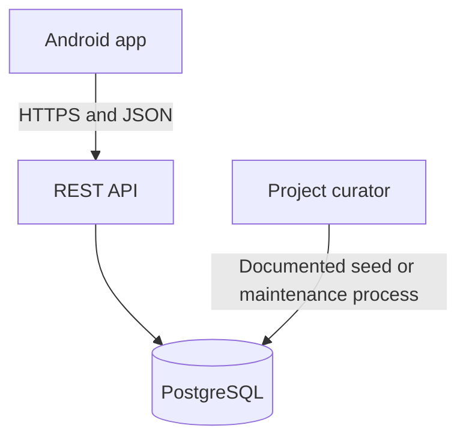

# Hyena App Software Requirements Specification

**Version:** 0.2 — Draft aligned with the Week 7 SRS template  
**Date:** October 3, 2026

## Title Page

### Project Name

Hyena App

### Team Members

Joseph Tolley. Additional team members have not been specified in this draft.

### Description of Project

Hyena App is an Android application for finding nearby food specials, local events, and other time-sensitive experiences happening today or tonight. Users select a discovery area, browse curated listings, search and filter results, and optionally create an account to save experiences.

## Section 1

### Introduction

We chose this project to make it easier to find local experiences and food deals that are relevant to a particular day or evening. The project began as an app for local food specials and expanded to include nearby activities and events. It gives us a practical senior project involving Android development, a service API, and relational data, while addressing the question of what someone can do nearby today or tonight.

### Purpose

Hyena App will bring curated local experiences into a searchable Android interface. The application will help users choose an area, discover available experiences, review venue and schedule information, and keep a saved list through optional account access. This SRS defines the requirements and verification criteria for that first release.

### Scope

The proposed MVP includes area selection, a discovery feed, experience details, keyword search, category and date/time filters, weekly recurrence, optional accounts, and saved experiences. The initial data will be curated by the project team. Map view and Surprise Me remain optional features pending a scope decision. Build My Night is a stretch goal. Public listing submissions, payments, ticket purchases, reservations, social feeds, messaging, reviews, push notifications, and algorithmic personalization are outside the initial release.

### Technologies Used

| Technology | Intended use | Status |
| --- | --- | --- |
| Kotlin | Android application code | Existing project direction |
| Jetpack Compose and Material 3 | Android screens and controls | Existing project direction |
| Android Studio and Gradle | Development and builds | Existing project tooling |
| PostgreSQL | Shared listing, schedule, account, and saved-experience data | Planned |
| HTTPS REST API with JSON | Communication between the Android app and service | Planned |
| Node.js and Express | Service implementation | Proposed |
| Git and GitHub | Source control and project documentation | Existing repository |
| Map provider | Optional map presentation | Undecided |

### Definitions

| Term | Meaning |
| --- | --- |
| Experience | A time-bounded event, promotion, special, or activity associated with a business or venue. |
| Occurrence | One dated instance of an experience, calculated from its schedule and local time zone. |
| Discovery area | The city, postal code, or other named area selected by the user to find nearby listings. |
| Curated data | Listing information entered or maintained by the project team rather than submitted by the public. |
| MVP | The smallest release that supports the core discovery and saved-experience workflow. |

## Section 2a

### Must Have Requirements

The following requirements define the proposed MVP. “Shall” indicates required behavior. Each requirement includes an acceptance check for verification.

| ID | Priority | Requirement | Requirement and acceptance check |
| --- | --- | --- | --- |
| FR-01 | Must | Browse without account | The app shall allow a visitor to browse experience listings and view their details without registering or signing in. A fresh install can reach the discovery feed without an account prompt. |
| FR-02 | Must | Choose discovery area | The app shall let a user choose and change a named discovery area using a supported text input such as city or postal code. The selected area is visible and changing it refreshes the result set. |
| FR-03 | Must | View discovery feed | The app shall show experiences matching the selected area, ordered by the next upcoming occurrence. A seeded listing with a future occurrence appears in the feed; an expired occurrence does not. |
| FR-04 | Must | Today and tonight views | The app shall provide date/time views for experiences available today and tonight in the experience’s local time zone. A listing appears in the correct view based on its local occurrence window. |
| FR-05 | Must | View experience details | The app shall display the experience title, business or venue, description, location, schedule, and any available offer details. Tapping a listing opens a detail view with its stored fields; absent optional data is not shown as invented content. |
| FR-06 | Must | Search listings | The app shall allow keyword search across experience title, description, business name, and category. A matching query returns the seeded matching record; a nonmatching query shows an empty state. |
| FR-07 | Must | Filter listings | The app shall filter listings by category and selected date/time view. Selecting a category and Today returns only records matching both filters. |
| FR-08 | Must | Represent recurring schedules | The system shall store weekly recurrence day(s), local start and end time, effective start date, optional end date, and IANA time-zone identifier. A recurring test record generates the expected local dates across a daylight-saving transition. |
| FR-09 | Must | Save experience | A registered user shall be able to save and unsave an experience. The saved state updates and remains after closing and reopening the app. |
| FR-10 | Must | View saved experiences | A registered user shall be able to view their saved experiences. The saved list contains only experiences saved by the authenticated user. |
| FR-11 | Must | Optional account access | The app shall support account registration, sign-in, and sign-out for users who want saved experiences synced to an account. A new account can sign in, sign out, and sign in again; browsing remains available while signed out. |
| FR-12 | Must | Separate user data | The service shall associate saved experiences with the authenticated user and prevent one user from reading or changing another user’s saved list. API tests with two accounts show isolated saved lists and reject cross-account mutations. |
| FR-13 | Must | Show useful empty and error states | The app shall explain when no experiences match and provide a retry action when listing retrieval fails. Empty results and simulated service failure produce distinct, actionable states. |
| FR-16 | Must | Curated listing data | The MVP shall obtain business, experience, category, and recurrence data from project-curated records. The release dataset can be loaded through the team’s documented seed or maintenance process. |

### Nonfunctional Requirements

| ID | Quality | Requirement |
| --- | --- | --- |
| NFR-01 | Performance | Under a normal mobile connection, the discovery screen should display cached or retrieved results within 3 seconds for a result set of up to 100 records. API response time target is p95 under 2 seconds for standard discovery queries. |
| NFR-02 | Security | All service traffic shall use HTTPS. Passwords shall be stored only as salted, adaptive hashes. Authenticated endpoints shall authorize every saved-experience operation against the signed-in user. |
| NFR-03 | Privacy | The MVP shall not collect precise GPS coordinates. Account fields shall be limited to what sign-in and saved-item ownership require; the team must document retention and deletion behavior before collecting real user data. |
| NFR-04 | Usability | Primary discovery, detail, and save actions shall be reachable through the app’s visible navigation and controls without requiring gestures alone. |
| NFR-05 | Accessibility | Interactive controls shall have accessible labels, support Android font scaling, and provide touch targets of approximately 48 dp where practical. Text and control contrast shall be checked before release. |
| NFR-06 | Compatibility | The Android app shall support the project’s agreed minimum API level. Prior setup used API 28; the team shall verify this against the current repository and test on at least one emulator or device at the minimum supported level. |
| NFR-07 | Time correctness | Occurrence generation and display shall use the venue’s IANA time zone. A weekly occurrence shall retain its intended local wall-clock time when daylight-saving offsets change. |
| NFR-08 | Data integrity | Database constraints shall prevent duplicate saved pairs and invalid references. Experiences and businesses referenced by saved records shall not be hard-deleted without an explicit retention rule. |
| NFR-09 | Reliability | A service error shall not crash the app. The client shall present retry behavior and preserve the selected area and filters when feasible. |
| NFR-10 | Maintainability | The Android client, API, and database schema shall be organized so UI, service, and persistence responsibilities can be changed independently. API and schema decisions shall be documented in the SDD. |

## Section 2b

### Stretch Requirements

These features are optional and do not block completion of the core MVP. Map view was previously classified as Should, and Surprise Me as Candidate; those priorities remain visible below.

| ID | Priority | Requirement | Requirement and acceptance check |
| --- | --- | --- | --- |
| FR-14 | Should | Map view | The app should show eligible experiences on a map and let the user open a listing from a map marker. When a map provider is configured, a seeded venue marker opens its matching detail view. |
| FR-15 | Candidate | Surprise Me | The app may offer a Surprise Me action that selects one eligible experience from the current area and active filters. Repeated actions return valid matching listings when at least one result exists and a clear empty state otherwise. |
| SR-01 | Stretch | Build My Night | The application may help a user assemble multiple experiences into an evening plan. This feature needs a separate requirements and acceptance definition before implementation. |

## Section 2c

### Weekly Schedule

Project Week 1 corresponds to course Week 3. The first three milestones come from the current project plan. Later rows are proposed sequencing to make the Week 7 document useful now; they are not confirmed deadlines or completed work.

| Project week | Course week | Tasks and milestone | Status of plan |
| --- | --- | --- | --- |
| Week 1 | Week 3 | Finalize requirements, define the MVP, and establish the overall application architecture. | Established milestone |
| Week 2 | Week 4 | Set up Android navigation, screen structure, and the basic user interface. | Established milestone |
| Week 3 | Week 5 | Create the PostgreSQL database and tables for businesses, experiences, categories, users, saved experiences, and recurrence data. | Established milestone |
| Week 4 | Week 6 | Implement discovery and detail service operations and connect the Android feed to curated data. | Proposed |
| Week 5 | Week 7 | Add search, filters, and recurrence handling; review this SRS and record remaining design decisions. | Proposed |
| Week 6 | Week 8 | Implement optional accounts, saved experiences, and checks for access isolation. | Proposed |
| Week 7 onward | Week 9 onward | Complete integration, run the verification plan, fix defects, and evaluate stretch features against remaining time. | Proposed; final course deadline not supplied |

## Section 3 Design Overview of the Product

### Workflow

- First visit: the user chooses a discovery area and lands on a feed of upcoming experiences relevant to that area.

- Discovery: the user selects Today or Tonight, applies category or keyword filters, and scans matching listings.

- Details: the user opens an experience to see its title, business, description, venue, date/time, price or offer details when provided, and source/contact information when available.

- Saving: a visitor who chooses to save an item is asked to sign in or create an account; a registered user can save or remove it and view saved items later.

- Recurring event: the system calculates dated occurrences from a weekly schedule in the venue’s local time zone and includes the correct occurrence in date-based discovery.

### Resources

| User class | Needs |
| --- | --- |
| Visitor | Browse, search, filter, and view experiences without creating an account. |
| Registered user | Use visitor features and save or remove experiences associated with their account. |
| Project curator | Prepare and maintain experience, business, category, and recurrence records through the team’s chosen data-entry process. A curator-facing admin UI is not required for MVP. |

Development resources include the Android project, GitHub repository, an Android emulator or test phone, a PostgreSQL instance, the proposed API service, and a curated seed dataset. Hosting and map services remain undecided.

### Data at Rest

The initial relational model shall include the following entities. Exact columns, keys, indexes, and migration strategy belong in the SDD and database scripts.

| Entity | Purpose | Key relationships |
| --- | --- | --- |
| Business | Venue or organization associated with listings. | One business may have many experiences. |
| Experience | Discoverable event, special, or promotion. | Belongs to a business; has one or more categories and schedule data. |
| Category | Classification used for browsing and filtering. | Many-to-many with experiences if an experience can have multiple categories. |
| User | Registered account used for saved items. | One user may save many experiences. |
| SavedExperience | Join record for a user’s saved listing. | References one user and one experience; unique per pair. |
| Schedule / recurrence | Weekly local schedule and effective date range. | Belongs to an experience and includes a time-zone identifier. |

Account passwords will be stored as salted adaptive hashes. Saved items will be associated with a user and constrained to one record per user–experience pair. The client should retain the selected discovery area and filters when feasible; the local persistence mechanism remains a design decision.

### Data on the Wire

The planned service uses a versioned HTTPS REST API with JSON request and response bodies. The precise endpoints and schemas are an SDD/API design decision. At minimum, the API must support experience discovery and detail retrieval, categories, recurrence data, account access, and authenticated saved-experience operations.

Requests will carry discovery filters or account and saved-item actions; responses will carry listing, category, schedule, and result/error data. Private saved-item operations require authentication and authorization. Credentials must travel over HTTPS and must not be included in URLs or application logs.

### Data State

- Each experience is associated with at least one business or venue and at least one category unless the team explicitly documents an exception.

- A recurring schedule is interpreted in the venue’s local time zone; the server stores the IANA zone name rather than relying on the phone’s current zone.

- Today and Tonight are evaluated from the relevant experience occurrence in local time. The team must define the exact evening cutoff before implementation; a proposed default is 5:00 p.m. through 11:59 p.m. local time.

- An experience with an end date earlier than the current occurrence is excluded from current discovery results.

- Saved records are unique by user and experience. Removing a saved item does not delete the experience itself.

The client must distinguish loading, populated results, empty results, and service failure. Account state is signed out or signed in; a saved item is saved or unsaved for the current user. Occurrences are upcoming, currently available, or expired according to their schedule. The precise API and database representation of these states will be defined in the SDD.

### HMI HCI GUI

The Android client shall use a consistent navigation structure with clear destinations for discovery and saved experiences. A first-run area selection must lead into discovery. List cards must expose enough information to distinguish experiences, and each card must open an accessible detail screen. Loading, empty, and error states must be visible and understandable.

Planned screens include area selection, discovery with search and filters, experience details, saved experiences, and account access. Map view is optional. The interface must support accessible labels, font scaling, and clear touch controls. Browsing uses a selected area and does not require precise GPS access.

### Pictures and Diagrams

The diagram shows the proposed architecture. The API framework is still a proposal, and database and service implementation have not been verified as complete.

Screenshots of the implemented screens should be added when they are available. No finished discovery screens are claimed in this draft.

### Current Baseline and Open Decisions

Hyena App is a new Android client. The existing repository was reviewed earlier on October 3, 2026 and contained the Android starter experience rather than the discovery product. Prior setup notes identify Kotlin, Jetpack Compose, and Material 3 as the client direction. A REST service and PostgreSQL database are proposed but have not been verified as implemented. The exact hosting provider, map provider, and curated-data workflow remain open decisions.

The client targets Android phones. The project’s earlier setup used a minimum Android API level of 28 and Jetpack Compose; the team should recheck the repository configuration before implementation. The proposed service is accessed over HTTPS and stores shared listing and account data in PostgreSQL. Browsing should not require GPS permission; the user-selected area is the MVP location input.

| Decision | Current position | Needed before |
| --- | --- | --- |
| Backend framework | Node.js/Express is proposed; not verified as implemented. | SDD and API implementation |
| Database hosting | PostgreSQL is planned; host is undecided. | Database setup |
| Map provider | Undecided; map feature remains a candidate requirement. | Map implementation |
| Tonight cutoff | Proposed 5:00 p.m.–11:59 p.m. in venue local time. | Date/time filter implementation |
| Authentication method | Optional account for saving; provider and verification flow are undecided. | Account implementation |
| Discovery radius | The user selects a named area; exact area lookup/geocoding approach is undecided. | Area selection implementation |
| Curated data maintenance | Team-managed seed or direct database maintenance; no admin UI in MVP. | Database and demonstration dataset |

## Section 4 Verification

### Demo

The MVP is ready for a project demonstration when all Must requirements have passing tests or documented manual checks, the seed dataset supports each core workflow, and the Android app can retrieve and display discovery results from the agreed service or a documented development substitute.

- A signed-out visitor can select an area, browse, search, filter, and open an experience.

- A recurring weekly listing appears on the correct local dates and keeps its local start time over a daylight-saving change.

- A user can create an account, sign in, save and unsave an experience, and see only their own saved records.

- Empty results, loading, and service failure are represented without crashing.

- The team has recorded the map and Surprise Me scope decision, the exact Tonight cutoff, and the selected backend and map provider.

### Testing

These are planned checks, not reported test results. Use the functional requirement acceptance checks above to record pass/fail results as implementation proceeds.

| Test area | Planned verification | Requirements covered |
| --- | --- | --- |
| Visitor workflow | On a fresh install, select an area, browse, open details, search, and combine category and time filters without signing in. | FR-01 through FR-07 |
| Recurrence | Check weekly weekdays, effective date bounds, expired occurrences, and a daylight-saving transition in the venue’s time zone. | FR-08, NFR-07 |
| Accounts and saved items | Register, sign in, save, unsave, restart, and sign out; use two accounts to verify data separation. | FR-09 through FR-12, NFR-02, NFR-08 |
| Error handling | Simulate an empty result set and an unavailable service; confirm useful messages and retry behavior without a crash. | FR-13, NFR-09 |
| Curated dataset | Load the seed dataset and verify venue, category, recurrence, and foreign-key relationships. | FR-16, NFR-08 |
| Performance | Measure discovery display time and API response times against the proposed NFR-01 targets under documented conditions. | NFR-01 |
| Android compatibility and accessibility | Check the agreed minimum API level, font scaling, labels, contrast, and touch controls on an emulator or phone. | NFR-04 through NFR-06 |
| Optional features | If included, confirm that markers and Surprise Me open eligible experiences matching current filters. | FR-14, FR-15 |

### Sources Citation and Resource Links

- Project repository: [omgitzjoe/HyenaApp](https://github.com/omgitzjoe/HyenaApp).
- Required document structure: the supplied `SRSTemplate (1).docx` for Week 7.
- Requirements source: the existing Hyena App SRS draft and the project decisions discussed on October 3, 2026.
- Baseline source: the earlier repository review and Android setup notes described in the existing draft. The repository was not rechecked during this format conversion.

The companion SDD should specify screen navigation, API contracts, PostgreSQL columns and constraints, and recurrence generation. Proposed thresholds and open decisions require project review before this draft becomes the final requirements baseline.
