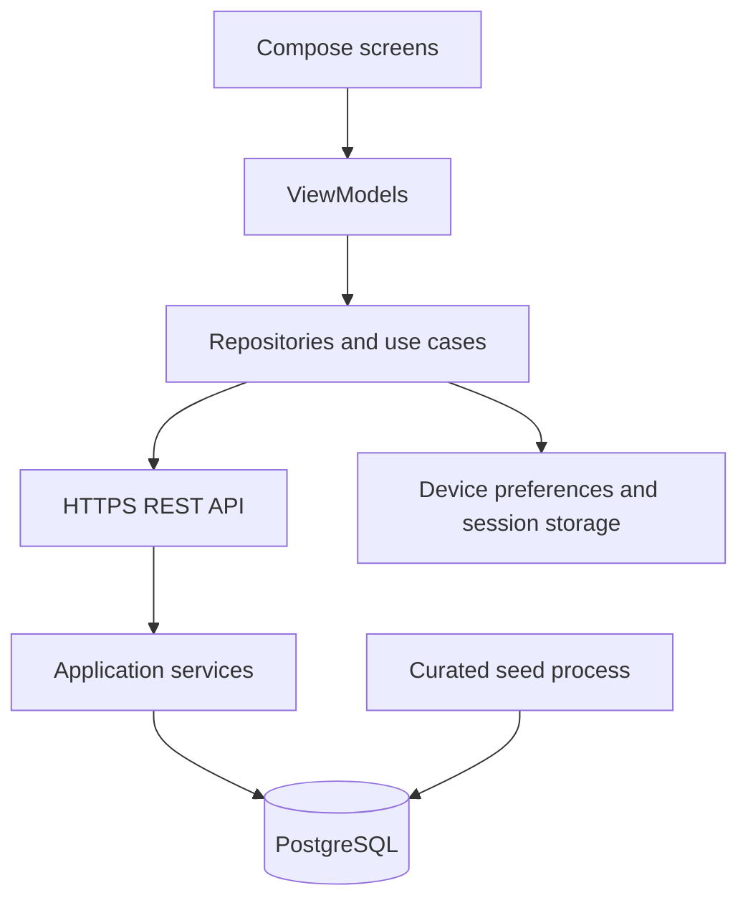
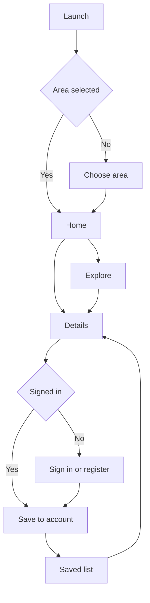
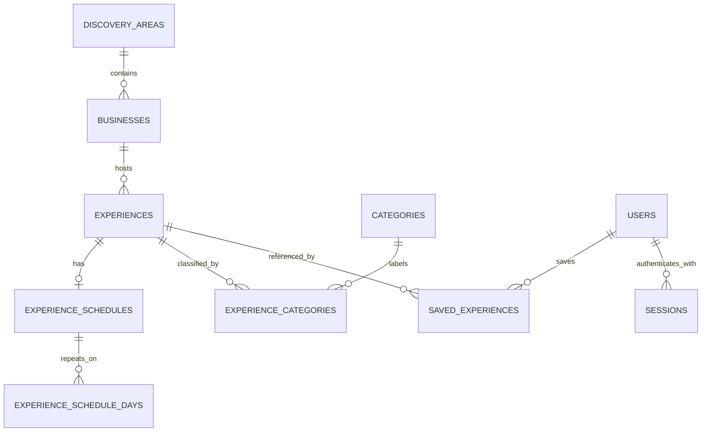

# Hyena App Software Design Description

**Version:** 0.1 — Draft design  
**Date:** October 3, 2026  
**Project owner:** Joseph Tolley  
**Intended repository path:** `doc/Hyena_App_SDD.md`

## 1 Introduction

### 1.1 Purpose

This document describes how we plan to implement the requirements in the Hyena App SRS. It defines the Android structure, screen behavior, API contracts, PostgreSQL model, recurrence rules, and verification approach. It is an implementation guide; the components described here are planned unless identified as existing.

### 1.2 Source documents and precedence

The current repository documents were read before preparing this design:

| Source | Version or reference | Role |
| --- | --- | --- |
| `doc/Hyena_App_SRS.md` | Version 1.0; blob `42af497216b97b1101f64e9f13fd05ddbe2659be` | Current requirement baseline |
| `doc/HyenaApp_Blueprint.md` | Blob `8227f4066d820cc711f878b46dee7deeb56c41c5` | Product direction and longer-term ideas |
| `app/build.gradle.kts` | Read October 3, 2026 | Existing Android configuration |
| `app/src/main/java/com/example/hyenaapp/MainActivity.kt` | Read October 3, 2026 | Existing application entry point |
| `app/src/main/AndroidManifest.xml` | Read October 3, 2026 | Existing permissions and application configuration |

The SRS governs release scope where the documents differ. The blueprint places accounts outside the MVP and includes maps in its broader MVP list. The newer SRS requires optional account access for saving and classifies maps and Surprise Me as optional. This design follows the SRS. We should reconcile those blueprint sections during the next documentation update.

### 1.3 Existing implementation

The repository contains a Kotlin Android application with Jetpack Compose and Material 3. `MainActivity` currently renders “Hello Android.” Its namespace and application ID are `com.example.hyenaapp`; its minimum SDK is 28, target SDK is 37, and compile SDK is release 37 with minor API level 1. The Java source and target compatibility settings are 11; those settings do not establish the Gradle runtime JDK requirement.

There is no implemented API, database, discovery screen, account flow, or navigation graph in the inspected tree. The manifest does not yet declare Internet permission. This design does not claim that those features are already built.

### 1.4 Design status

The design makes concrete working proposals so implementation can proceed. Node.js/Express, the client network libraries, account-session method, and recurrence policies below remain proposals rather than previously approved project decisions. Hosting, mapping provider, final discovery area, and the Tonight cutoff remain open.

## 2 Architecture and design decisions

### 2.1 System structure

The Android client handles presentation and user actions. The API handles validation, account access, discovery filtering, recurrence evaluation, and saved-item ownership. PostgreSQL holds shared records. The app never connects directly to PostgreSQL.



### 2.2 Working choices

| Area | Proposed design | Reason |
| --- | --- | --- |
| Android presentation | Compose, Material 3, screen-scoped ViewModels, immutable UI state | Extend the current app and make loading and errors explicit |
| Navigation | Compose navigation with Home, Explore, Saved, Details, Area, and Account destinations | Follow the blueprint while keeping optional features removable |
| Async work | Kotlin coroutines and StateFlow | Keep requests outside composables and expose observable state |
| Networking | Retrofit with a compatible JSON converter; DTOs separate from domain models | Centralize API calls and keep server fields out of presentation code |
| Local preferences | DataStore for selected area and filter preferences | Preserve lightweight settings without storing the whole server database |
| Session storage | App-private storage encrypted using an Android Keystore-backed key | Persist a session without keeping a plaintext bearer token or password |
| Backend | Node.js with Express and the `pg` driver | Use a small service with explicit SQL and module boundaries |
| Database changes | Ordered SQL migrations tracked in a schema-migrations table | Reproduce the schema and make updates reviewable |
| Authentication | Random opaque bearer tokens backed by revocable database sessions | Keep sign-out and session revocation straightforward |
| Recurrence | Evaluate bounded date ranges on the server using local dates and an IANA zone | Give every client the same availability result |
| Initial data | Validated, repeatable seed files and scripts | Make demonstration data reproducible |

Library versions must be chosen against the existing Gradle configuration and locked when dependencies are added. This document does not prescribe unverified version numbers.

### 2.3 Release boundary

Home, Explore, Details, area selection, optional account access, and Saved are the core screens. Accounts are optional to the visitor but required by the SRS for account-owned saves. Map, Surprise Me, preferences-based recommendations, and Build My Night are optional extensions. No GPS permission or public listing submission UI is required for the first release.

## 3 Android client design

### 3.1 Package responsibilities

Keep `MainActivity` as the entry point and extend the existing theme. The following package names are proposed beneath `com.example.hyenaapp`:

| Package | Responsibilities and representative files |
| --- | --- |
| `navigation` | `HyenaNavGraph`, typed routes, bottom navigation |
| `ui.home` | Home screen and `HomeViewModel` |
| `ui.explore` | Search, filters, results, and `ExploreViewModel` |
| `ui.details` | Experience details and save actions |
| `ui.saved` | Account-owned saved list and availability labels |
| `ui.account` | Registration, sign-in, and account controls |
| `ui.area` | Selection of supported discovery areas |
| `ui.components` | Experience cards, filter chips, loading and error views |
| `ui.theme` | Existing theme, typography, and color definitions |
| `domain.model` | `Experience`, `Occurrence`, `Business`, `Category`, `DiscoveryArea` |
| `domain.usecase` | Shared discovery and save orchestration where useful |
| `data.remote` | API interface, DTOs, response parsing |
| `data.repository` | Experience, saved-item, account, and area repositories |
| `data.local` | Area preferences and protected session storage |

For simple retrieval, a ViewModel can call a repository directly. Use cases are introduced for shared or multi-step behavior rather than one wrapper for every method. A small application container can supply repositories and ViewModel factories initially.

### 3.2 Navigation and screens

| Screen or route | Content and actions | Exit behavior |
| --- | --- | --- |
| `area` | Search supported city/postal-code labels; select one area | Persist area ID, then open Home |
| `home` | Selected area, Today/Tonight controls, upcoming cards, search entry | Open Details or Explore; change area |
| `explore` | Keyword input, category filter, day/time filter, ordered results | Open Details; preserve filters on Back |
| `details/{experienceId}` | Business, description, categories, offer/price, venue, schedule, requirements, source link, Save | Return to originating screen with its state intact |
| `saved` | Upcoming/available items and a separate unavailable group | Open Details or remove a save |
| `sign-in` | Email and password with inline validation | Resume the pending save after success |
| `register` | Email, password, optional display name | Create account/session and resume intended action |
| `account` | Account summary and sign-out | Clear private state and return to visitor behavior |
| `map` | Optional provider-backed markers and listing previews | Open Details; hidden from navigation until implemented |

Bottom navigation initially contains Home, Explore, and Saved. Add Map only when the optional feature is usable. Settings/account controls are reachable from Home. A visitor entering Saved sees a sign-in explanation with a way to continue browsing.



### 3.3 State and requests

Each data-driven screen exposes one state containing `Loading`, `Content`, `Empty`, or `Error`, plus the active filters and any in-progress mutation. Retaining old content while refreshing is allowed, but it must be marked as refreshing. UI state is collected with lifecycle awareness. Composables emit actions to their ViewModels; they do not issue network requests while rendering.

Search input is debounced by a proposed 300 ms. Changing a query or filter cancels or supersedes the previous request; a late response for old filters cannot replace current results. An area change clears result pagination. Configuration changes retain state through ViewModels, and selected area/preferences survive restart through local storage.

A save button displays progress while its request is pending. Update the saved state after the server confirms success; show a retryable error on failure. Do not silently mark a failed request as saved. After successful login, resume a pending save only if its experience remains valid and the user has not cancelled the action.

### 3.4 Local data and privacy

Only area/filter preferences and a protected session token persist locally in the initial design. Listing data is held in memory; full offline browsing is not an MVP guarantee. Do not persist passwords. Exclude session material from Android backup and device-transfer rules. On sign-out or session rejection, clear the token, saved-list memory, and other account-specific state before another account can sign in.

Use semantic labels, readable contrast, font scaling, and accessible touch targets. A missing optional image or price is represented with an appropriate placeholder or omitted label; it is not replaced with fabricated information.

## 4 Backend design

### 4.1 Modules

The proposed `backend/` directory is separate from the existing `app/` module.

| Module | Responsibility |
| --- | --- |
| `src/app` | Express configuration, request IDs, JSON parsing, route mounting, error handler |
| `src/routes` | Areas, categories, experiences, auth, and current-user saved endpoints |
| `src/middleware` | Request validation, session authentication, rate limiting |
| `src/services/discovery` | Compose area, category, search, and occurrence filters |
| `src/services/recurrence` | Generate and classify local-time occurrences |
| `src/services/auth` | Registration, password verification, session issuance/revocation |
| `src/services/saved` | Save, unsave, retrieve, and availability grouping |
| `src/repositories` | Parameterized SQL and transaction boundaries |
| `db/migrations` | Numbered schema changes |
| `db/seeds` | Curated dataset and repeatable loading process |
| `tests` | Service tests and API/database integration checks |

Routes validate input, call services, and map outcomes to HTTP. Services own rules. Repositories own SQL. Database connections come from one bounded pool; write transactions use the same checked-out connection until commit or rollback.

### 4.2 Listing maintenance

The project curator maintains records using validated seed/import scripts. There are no public listing write endpoints in the MVP. Importing one listing, its schedule, weekdays, and category associations is atomic. Use stable seed IDs and upsert known records so rerunning a seed does not duplicate them. Keep production import credentials outside the Android client.

## 5 API contracts

### 5.1 Conventions

Base path: `/api/v1`. JSON field names use camelCase. IDs are UUID strings. Dates are `YYYY-MM-DD`; local times are `HH:mm:ss`; occurrence timestamps are ISO 8601 instants with `Z` or an explicit offset. Return the IANA `timeZone` alongside occurrence instants so the app can display venue-local time.

Use `Authorization: Bearer <session-token>` for private operations. Public discovery does not require a token. Never accept a client-supplied user ID as the owner of a saved list; derive ownership from the authenticated session.

### 5.2 Endpoints

| Method | Path | Access | Request and result |
| --- | --- | --- | --- |
| GET | `/health` | Public, outside versioned API | Basic service status; do not expose credentials or detailed topology |
| GET | `/api/v1/areas?q=...` | Public | Search supported area labels; return IDs, display labels, and time zones |
| GET | `/api/v1/categories` | Public | Category IDs, names, slugs, and optional icon identifiers |
| GET | `/api/v1/experiences` | Public | Filtered discovery results with one next matching occurrence per experience |
| GET | `/api/v1/experiences/{id}` | Public for active records; authenticated saved owner for unavailable records | Experience/business/category detail, schedule, and relevant occurrences |
| POST | `/api/v1/auth/register` | Public, rate limited | Email, password, optional display name; return user and session; HTTP 201 |
| POST | `/api/v1/auth/login` | Public, rate limited | Email/password; return user and session; HTTP 200 |
| POST | `/api/v1/auth/logout` | Session required | Revoke current session; HTTP 204 |
| GET | `/api/v1/me` | Session required | Current user summary without password or session hashes |
| GET | `/api/v1/me/saved-experiences` | Session required | Saved listings with current availability and next occurrence |
| PUT | `/api/v1/me/saved-experiences/{experienceId}` | Session required | Idempotent save; HTTP 201 if created, HTTP 200 if already saved |
| DELETE | `/api/v1/me/saved-experiences/{experienceId}` | Session required | Idempotent removal; HTTP 204 even if already absent |
| DELETE | `/api/v1/me` | Session and password confirmation required | Delete account, saved links, and sessions in one transaction; HTTP 204 |

The account-deletion endpoint is a proposed addition to support the SRS privacy requirement. Password reset and email verification are not designed here and require a scope decision before a public launch; this draft supports a controlled project demonstration.

### 5.3 Discovery parameters

| Parameter | Rule |
| --- | --- |
| `areaId` | Required supported area UUID; restrict results to its business membership |
| `q` | Optional trimmed keyword string; proposed maximum 100 characters |
| `categoryId` | Optional valid category UUID |
| `window` | `today`, `tonight`, `now`, or `date`; Today is the default |
| `date` | Required only for `window=date`; interpreted in each listing’s venue time zone |
| `limit` | Default 20, maximum 100 |
| `cursor` | Optional opaque page cursor bound to filters and evaluation time |

Unknown filter values return 400. An unknown area returns 400 with `INVALID_AREA`; an empty supported area returns 200 with an empty list. A date query returns a single local calendar-day window. Larger date ranges may be added later but must remain bounded; the internal recurrence service accepts at most 31 days per evaluation.

Search matches title, description, business name, and category names case-insensitively. Category and time filters combine with AND. Escape literal wildcard characters if using SQL `ILIKE`, and parameterize all input. Search ranking is not part of the core ordering; results sort by next matching occurrence start, then experience ID.

A cursor contains the last sort key, an evaluation timestamp, and a hash of the filters, protected by a server signature. Expire it after a proposed five minutes. Continuation requests keep the first page’s time-window evaluation; a fresh search uses the current clock. Listing edits between pages can still change membership, so this is not a database snapshot. Reject mismatched or expired cursors with 400 and let the client restart the query.

### 5.4 Discovery response example

This is an illustrative response for a seeded Tuesday listing. The UUIDs are example values.

```json
{
  "items": [
    {
      "id": "11111111-1111-4111-8111-111111111111",
      "title": "Taco Tuesday",
      "type": "SPECIAL",
      "business": {
        "id": "22222222-2222-4222-8222-222222222222",
        "name": "Example Tacos",
        "city": "Rexburg"
      },
      "categories": [{"id": "33333333-3333-4333-8333-333333333333", "name": "Food"}],
      "price": {"amount": "2.00", "currency": "USD", "label": "$2 tacos"},
      "imageUrl": null,
      "nextOccurrence": {
        "startsAt": "2026-10-06T23:00:00Z",
        "endsAt": "2026-10-07T03:00:00Z",
        "timeZone": "America/Denver",
        "localDate": "2026-10-06",
        "status": "UPCOMING"
      }
    }
  ],
  "nextCursor": null,
  "evaluatedAt": "2026-10-06T22:00:00Z"
}
```

The detail response additionally includes description, full address, website/source URL, restrictions, recurrence kind, effective dates, local times, weekday list, and `endsNextDay`. Price amounts are decimal strings to avoid binary floating-point representation. Null means unknown or not supplied; `0.00` means explicitly free.

### 5.5 Errors

```json
{
  "error": {
    "code": "INVALID_FILTER",
    "message": "Choose a supported date window.",
    "requestId": "request-id"
  }
}
```

| Status | Meaning |
| --- | --- |
| 400 | Invalid request fields, area, filter, date, or cursor |
| 401 | Missing, invalid, revoked, or expired session; login failures use one generic message |
| 403 | Authenticated action is forbidden |
| 404 | Experience is missing or unavailable to this caller |
| 409 | Registration conflicts with an existing normalized email |
| 429 | Rate limit exceeded; provide retry guidance |
| 500 or 503 | Unexpected error or unavailable dependency; expose a request ID, not internal SQL or a stack trace |

## 6 PostgreSQL design

### 6.1 Naming and shared rules

Use snake_case table and column names. Entity IDs are UUIDs generated by the API or seed script. Entity records have `created_at` and `updated_at` as `timestamptz`, defaulting to the database clock; writes explicitly maintain `updated_at`. Configure service/database sessions for UTC. Store local recurrence times as `time without time zone` and effective dates as `date`; store the IANA zone separately. A `timestamptz` instant does not retain the original named zone by itself.

Use foreign keys and check constraints, plus transactional service validation for rules that span multiple rows. `is_active=false` unpublishes an experience; it preserves historical saved references. Business records use the same inactive policy, and their inactive status excludes their listings from public discovery. No ordinary listing workflow hard-deletes referenced businesses or experiences.

### 6.2 Tables

#### discovery_areas

Supported-area records avoid requiring a live geocoding provider for MVP. The initial area and postal-code coverage are curator-defined.

| Column | Type | Constraints or meaning |
| --- | --- | --- |
| `id` | uuid | Primary key |
| `name` | text | Required display label |
| `slug` | text | Required unique identifier |
| `postal_codes` | text[] | Optional supported search aliases |
| `time_zone` | text | Required valid IANA zone |
| `latitude`, `longitude` | numeric(9,6) | Optional area center; both present or both absent |
| `is_active` | boolean | Required, default true |

#### businesses

| Column | Type | Constraints or meaning |
| --- | --- | --- |
| `id` | uuid | Primary key |
| `area_id` | uuid | Required FK to discovery_areas; delete restricted |
| `name` | text | Required, nonblank; names need not be globally unique |
| `description` | text | Optional |
| `address`, `city`, `region`, `postal_code` | text | Address/city required for published MVP listings; remaining fields as available |
| `latitude`, `longitude` | numeric(9,6) | Optional venue coordinates; latitude −90 to 90, longitude −180 to 180 |
| `phone`, `website_url`, `image_url` | text | Optional curated contact/media fields |
| `is_active` | boolean | Required, default true |

A business is assigned to one discovery area in MVP. Coordinates describe the public venue, not the user’s precise location. Area-center distance, if shown later, must be labeled as distance from the selected area center.

#### experiences

| Column | Type | Constraints or meaning |
| --- | --- | --- |
| `id` | uuid | Primary key |
| `business_id` | uuid | Required FK to businesses; delete restricted |
| `title` | text | Required, nonblank |
| `description` | text | Required |
| `type` | text | Required; `OFFER`, `EVENT`, `ACTIVITY`, or `SPECIAL` |
| `price_amount` | numeric(10,2) | Optional, nonnegative; zero is free |
| `currency` | char(3) | Required when price_amount is present; initial dataset uses USD |
| `price_label` | text | Optional offer wording, such as “$2 tacos” |
| `requirements` | text | Optional restrictions, age limits, or purchase conditions |
| `image_url`, `source_url` | text | Optional curated links |
| `is_active` | boolean | Required, default true |

#### categories and experience_categories

| Table | Columns | Constraints |
| --- | --- | --- |
| `categories` | `id uuid`, `name text`, `slug text`, `icon_key text nullable` | Primary key ID; unique name and slug; nonblank names |
| `experience_categories` | `experience_id uuid`, `category_id uuid` | Composite primary key; FKs to experiences and categories |

An experience can have several categories. The curator transaction must supply at least one category before publication. Tags, personal preferences, and recommendation weights are deferred until their feature scope is approved.

#### experience_schedules

One schedule per experience is sufficient for the initial release. Multiple same-day sessions can be added later through a schedule cardinality change.

| Column | Type | Constraints or meaning |
| --- | --- | --- |
| `id` | uuid | Primary key |
| `experience_id` | uuid | Required unique FK to experiences |
| `kind` | text | `ONCE` or `WEEKLY` |
| `start_date` | date | Required first eligible occurrence start date |
| `end_date` | date | Required for ONCE and equal to start_date; optional inclusive final start date for WEEKLY |
| `start_time`, `end_time` | time without time zone | Required local times |
| `ends_next_day` | boolean | Required, default false; explicitly supports overnight occurrences |
| `time_zone` | text | Required valid IANA zone, typically the area’s zone |

Check `end_date IS NULL OR end_date >= start_date`. For ONCE require `end_date=start_date`. Same-day schedules require `end_time > start_time`. Overnight schedules require `end_time <= start_time`, allowing up to a full local day. Longer events require a future schedule extension. `start_date` and `end_date` constrain occurrence start dates; an overnight occurrence may end the day after its last eligible start date.

Validate the zone name in the service/import process against the selected timezone library. SQL text alone does not guarantee that an IANA identifier is valid.

#### experience_schedule_days

| Column | Type | Constraints or meaning |
| --- | --- | --- |
| `schedule_id` | uuid | FK to experience_schedules |
| `iso_weekday` | smallint | 1 through 7, Monday through Sunday |

Composite primary key `(schedule_id, iso_weekday)`. WEEKLY schedules require at least one weekday; ONCE schedules require none. The curator service enforces this within the transaction because a simple row CHECK cannot count child rows.

#### users

| Column | Type | Constraints or meaning |
| --- | --- | --- |
| `id` | uuid | Primary key |
| `email` | text | Required normalized email with unique constraint |
| `display_name` | text | Optional |
| `password_hash` | text | Required salted adaptive hash, never returned by the API |

Normalize email by trimming and applying the documented case-insensitive account policy before storage. Treat passwords as exact strings; do not trim or alter them. Password hash parameters are managed by the selected password library and recorded with the hash.

#### saved_experiences

| Column | Type | Constraints or meaning |
| --- | --- | --- |
| `user_id` | uuid | FK to users, ON DELETE CASCADE |
| `experience_id` | uuid | FK to experiences, deletion restricted |
| `created_at` | timestamptz | Required save timestamp |

Composite primary key `(user_id, experience_id)`. Saving references an experience series, not one generated occurrence. A weekly listing remains saved across weeks. Availability is recalculated at read time, and inactive or expired saved listings remain in the unavailable group until the user removes them.

#### sessions

| Column | Type | Constraints or meaning |
| --- | --- | --- |
| `id` | uuid | Primary key |
| `user_id` | uuid | Required FK to users, ON DELETE CASCADE |
| `token_hash` | text | Required unique SHA-256 digest of a high-entropy random token |
| `created_at`, `expires_at` | timestamptz | Required; expiration must follow creation |
| `revoked_at` | timestamptz | Nullable; set on sign-out |

Using a fast hash for a random token is a separate design from hashing a human password, which requires an adaptive password hash. Do not store or log raw bearer tokens on the server.

### 6.3 Relationships



Publication validation requires a schedule and at least one category, even though an unpublished draft may exist before those associations are loaded.

### 6.4 Indexes and transactions

Add indexes on businesses `(area_id, is_active)`, experiences `(business_id, is_active)`, experience_categories `(category_id, experience_id)`, and sessions `(user_id)`. Unique/composite keys provide schedule-by-experience lookup, saved-list ownership lookup, and token-hash lookup. Add a saved-list ordering index `(user_id, created_at DESC, experience_id)` if needed. Inspect real query plans before introducing full-text or geographic extensions; the curated prototype can begin with bounded SQL candidate selection and literal keyword matching.

Registration handles the unique-email conflict and creates user/session atomically. Save uses `INSERT ... ON CONFLICT DO NOTHING`; unsave restricts its DELETE by both session user ID and experience ID. Listing imports update all associations atomically. Account deletion cascades saved items and sessions. Public APIs cannot invoke curator writes.

## 7 Recurrence and discovery algorithms

### 7.1 Time-window definitions

All windows use half-open intervals `[start, end)`. This means an event ending exactly when a window begins does not overlap it.

| View | Local window | Inclusion |
| --- | --- | --- |
| Today | Local midnight to the next midnight | Occurrence overlaps the day and has not ended at evaluation time |
| Tonight | Proposed 17:00 to the next midnight | Occurrence overlaps the evening and has not ended at evaluation time |
| Now | Evaluation instant | Start is at or before now, and end is after now |
| Selected date | Midnight to next midnight on that date | Any occurrence overlapping that date; label past occurrences if a past date is requested |

The SRS proposed “through 11:59 p.m.”; midnight as an exclusive upper bound includes that complete final minute. The 17:00 cutoff is still a proposal. Derive Today/Tonight dates separately in each schedule’s IANA zone. Never derive the venue’s date from the phone’s current time zone.

### 7.2 Occurrence generation

Capture one evaluation instant per request. Query active experiences/businesses for the selected area and keyword/category filters, then evaluate schedules before pagination. The recurrence service accepts an injected clock in tests; public requests cannot override the server clock arbitrarily.

```text
for each candidate schedule:
    determine the requested local window in the schedule's time zone
    enumerate eligible local start dates from one day before the window
        through the window's final local date
    apply start_date/end_date bounds to each occurrence start date
    for WEEKLY, retain dates whose ISO weekday is in schedule_days
    for ONCE, retain only start_date
    build local start date + start_time
    build end on same date or next date according to ends_next_day
    resolve start and end into UTC instants using the time-zone policy
    reject or flag any generated interval whose end is not after start
    retain intervals overlapping the requested window
    apply the view's expired/current availability rule
return each experience with its earliest retained occurrence
sort by occurrence start and experience ID, then apply pagination
```

Starting enumeration one day earlier includes a Monday-night occurrence that continues into Tuesday. It does not require storing an occurrence row for every week. Date bounds apply to local occurrence start dates, including cross-midnight cases.

### 7.3 Daylight-saving policy

The working policy is explicit so it can be tested and revised:

- Keep the scheduled local wall-clock time each week; do not repeat by adding a fixed number of UTC hours.
- For a nonexistent local time during a spring-forward gap, move it forward by the gap duration.
- For a repeated local time during a fall-back overlap, choose the earlier instant for the start and the later instant for the end.
- Calculate end independently using its local date/time and the same zone; do not assume duration is constant across offset changes.
- If resolution produces a nonpositive interval, omit it and record a curator-facing validation issue.

A timezone-capable backend library must expose these policies and pass fixture tests before selection. The exact library is open; native JavaScript Date arithmetic alone is not the design contract. Display the actual resolved venue-local timestamp, including a date change for overnight events.

Example: Taco Tuesday at 17:00–21:00 in `America/Denver` should remain at those local times when the seasonal offset changes. Its UTC timestamps change. A 23:00–01:00 overnight listing must be discoverable during both local dates where its interval overlaps the selected window.

### 7.4 Saved availability and optional ranking

A saved experience with a future or current occurrence is available; a completed one-time event or inactive listing is unavailable. An unbounded weekly schedule remains recurring rather than becoming permanently expired after this week. Use a separate bounded next-occurrence lookup: for weekly schedules, find the first eligible matching weekday on or after `max(today - 1 day, start_date)`, respecting end_date; include the prior day only for a still-running overnight occurrence. This also supports a future start date beyond the discovery range.

Core feed ordering follows FR-03. If Surprise Me is implemented, select from the same filtered eligible candidates, so randomness cannot bypass expiry or filters. The blueprint’s deterministic recommendation scoring can be an optional separate recommendation view later; changing the required core feed order needs an SRS update. Do not invent popularity values before collecting a defined metric.

## 8 Account access and security

Use an adaptive salted password hash, with Argon2id as the working proposal and parameters selected through the chosen library and deployment measurements. Rate-limit authentication attempts. Use one generic invalid-login response. Registration conflict behavior follows the API contract.

Generate a session token with at least 256 bits of cryptographic randomness. Return it once after registration/login, store only its hash in PostgreSQL, and give it a proposed seven-day absolute lifetime. Every private request verifies the hash, expiration, revocation, and user existence. Logout revokes the current session. Session expiry returns 401; the client clears private state and offers sign-in. There is no refresh-token flow in this initial design.

Public discovery may optionally be accompanied by an authenticated saved-list fetch; public listing responses do not need to expose account state. Private routes use only the user resolved from the session. The detail route may return an unavailable record only when the authenticated user owns its saved link; other callers receive 404. A new save of an inactive listing returns 404, while existing saved owners can still read and remove it. Never return password_hash, token_hash, or session tokens in general account/listing DTOs.

Require HTTPS in deployment. Limit JSON request size and string lengths, validate UUIDs, and use parameterized SQL. The database account used by the API has only the rights needed by the service; migration/import credentials are separate. Secrets live in deployment configuration, not the repository or mobile binary. Validate curated links and only open supported HTTP(S) website links from the client.

The account-deletion transaction removes account identifiers, saved links, and active sessions. Define deployment backup retention before real user enrollment; logical deletion from the live database cannot guarantee immediate deletion from retained backups. Logs must exclude passwords, raw tokens, and precise user location.

## 9 Installation and delivery

### 9.1 Planned repository additions

| Path | Planned contents |
| --- | --- |
| `app/` | Extend the existing Android project |
| `backend/` | API source, dependency lockfile, tests, migrations, seed process |
| `doc/Hyena_App_SDD.md` | This design document |
| `doc/` | Requirements, blueprint, later API/setup notes and screenshots |

Follow the blueprint’s feature-branch workflow. Suggested initial branches are `feature/navigation`, `feature/database`, and `feature/api`. Review changes and merge only after relevant checks pass.

### 9.2 Development setup

1. Open the existing Android project and sync with its Gradle wrapper. Confirm the installed SDK and Gradle runtime JDK satisfy the checked-in configuration.
2. Create a local PostgreSQL instance and separate development database/user.
3. Add the backend dependency manifest, lockfile, migration runner, and example environment file as implementation work.
4. Configure `DATABASE_URL`, `CURSOR_SIGNING_SECRET`, `PORT`, and the selected runtime settings. Keep actual secrets out of git.
5. Run ordered migrations and a curated development seed.
6. Start the API and verify service health and a discovery query.
7. Configure the Android build’s API base URL; add Internet permission.
8. Run the app on an emulator or device and verify area selection, discovery, and details.

The Android emulator can use an appropriate host alias for a service running on the development computer; a physical phone needs a reachable network address. Do not configure a physical device to call its own localhost for the computer’s API. Document the actual address in the setup guide when the environment is chosen.

If local HTTP is needed, permit it only in a debug-specific network configuration. Release builds use HTTPS and do not inherit a broad cleartext exception. Review backup rules before adding persistent sessions.

### 9.3 Delivery and recovery

Provide an Android APK for the project demonstration plus a reproducible backend/database setup guide. Hosting is not selected. Run migrations once through a controlled deployment step, then start the API. Health checks should distinguish basic process health from database readiness without leaking connection details. Back up the database before risky schema updates, record migration versions, and prefer reviewed forward fixes over destructive automated rollback.

## 10 Logging and failure handling

Server logs include request ID, route, status, duration, and a sanitized error code. Record recurrence/import validation failures with listing IDs so the curator can correct them. Do not include auth request bodies or sensitive headers. Clients show readable messages; backend stack traces remain server-side.

Public GET requests may be retried with a small bounded delay. Avoid automatic repeated registration/login requests. Save and unsave are idempotent, allowing retry after ambiguous network failure. The client must distinguish connectivity failure from an expired account session. Preserve the selected area and filters while presenting a retry control.

## 11 Verification and requirement traceability

### 11.1 Verification plan

| Layer | Checks |
| --- | --- |
| Recurrence unit tests | Weekly weekdays, ONCE schedules, inclusive date bounds, overnight overlap, exact-end exclusion, DST gaps/overlaps, future weekly start dates |
| Discovery service tests | Combined filters, expired exclusion, one result per experience, deterministic order, filtering before pagination, cursor/filter binding |
| Database integration | Unique normalized emails, saved-pair deduplication, FK restrictions, publication validation, transaction rollback |
| Authentication integration | Hash verification, session expiry/revocation, sign-out, two-user isolation, attempted ownership injection, account deletion |
| Client ViewModel tests | Loading/content/empty/error, stale-response rejection, login continuation, failed save, account-state clearing |
| Compose/device tests | Area → Home → Explore → Details → Save → Saved, Back navigation, font scaling, accessibility labels, SDK 28 and a current test device/emulator |
| End-to-end checks | Seed → API → Android discovery; service outage; session expiry during saving; unavailable saved listing |
| Performance checks | Record connection conditions, dataset size, API p95 target under 2 seconds, and discovery display target under 3 seconds from NFR-01 |

These are planned tests. Creating this document does not mean they have passed. The performance targets require measurement against the implemented service and device conditions.

### 11.2 Traceability

| Requirements | Design coverage |
| --- | --- |
| FR-01, FR-02 | Public routes, supported areas, first-run area selection |
| FR-03, FR-04 | Discovery ordering and venue-local windows |
| FR-05 | Detail screen and detail response |
| FR-06, FR-07 | Keyword/category/time filters and stale-request handling |
| FR-08 | Schedule tables and recurrence algorithm |
| FR-09, FR-10 | Idempotent saved endpoints, Saved screen, series-based ownership |
| FR-11, FR-12 | Registration/login/logout, sessions, per-user repository predicates |
| FR-13 | UI states, API errors, bounded retry behavior |
| FR-14, FR-15 | Optional Map route and eligible-candidate Surprise Me behavior |
| FR-16 | Curated seed/import transactions |
| NFR-01 | Query bounds, indexes, pagination, measured performance targets |
| NFR-02, NFR-03 | HTTPS, password/session storage, ownership, deletion and retention |
| NFR-04, NFR-05 | Navigation, semantic controls, touch targets and font scaling |
| NFR-06 | Existing SDK baseline and device verification |
| NFR-07 | Local date/time storage, named zones, explicit DST policy |
| NFR-08 | FK/check/unique constraints and transactional validation |
| NFR-09, NFR-10 | Error state handling, module boundaries, migrations and documentation |
| SR-01 | Build My Night deferred pending a separate design |

### 11.3 Immediate implementation sequence

1. Build navigation and screens against a fake repository using the same domain models and UI states planned for the API.
2. Add PostgreSQL migrations and a small seed with one-time, recurring, overnight, inactive, and expired examples. The blueprint’s larger dataset is an eventual target; a small fixture set makes initial correctness easier to verify.
3. Implement areas, categories, discovery, and detail API routes with recurrence tests.
4. Connect Android to the real API and verify filtering and failure states.
5. Implement optional accounts and account-owned saves, then check data isolation.
6. Measure performance and accessibility; add optional features only after the Must requirements work.

## 12 Open decisions and references

### 12.1 Decisions to review

| Decision | Working proposal or unresolved detail |
| --- | --- |
| Backend framework | Node.js/Express proposed by the SRS; confirm before adding the service |
| Network/client dependencies | Retrofit, coroutine state, DataStore, protected session storage; select compatible versions during implementation |
| Initial area | Supported-area table and curated membership; city/postal coverage not chosen |
| Tonight boundary | 17:00 to next midnight, exclusive; proposed |
| DST gaps/overlaps | Shift gap times forward; earlier start/later end for overlaps; proposed |
| Session and password method | Revocable opaque sessions and Argon2id; proposed |
| Timezone library | Select one that supports the specified resolution rules |
| Hosting and map provider | Undecided; mapping remains optional |
| Public account readiness | Email verification, account recovery, backup retention, and public deployment policy require scope review |
| Source-document consistency | Update blueprint account/map MVP wording to match the current SRS when reviewing scope |

### 12.2 References

- [Hyena App SRS](https://github.com/omgitzjoe/HyenaApp/blob/master/doc/Hyena_App_SRS.md)
- [Hyena App Blueprint](https://github.com/omgitzjoe/HyenaApp/blob/master/doc/HyenaApp_Blueprint.md)
- [Existing Android Gradle configuration](https://github.com/omgitzjoe/HyenaApp/blob/master/app/build.gradle.kts)
- [Existing application entry point](https://github.com/omgitzjoe/HyenaApp/blob/master/app/src/main/java/com/example/hyenaapp/MainActivity.kt)
- [Android architecture recommendations](https://developer.android.com/topic/architecture/recommendations) — reference for ViewModels, UI state, and repository responsibilities.
- [PostgreSQL date and time types](https://www.postgresql.org/docs/current/datatype-datetime.html) — reference for separating stored instants from local times and named time zones.

This SDD is a working design for the current requirements. Update it alongside implementation when a proposal changes, keeping API contracts, migrations, Android models, and test expectations consistent.
